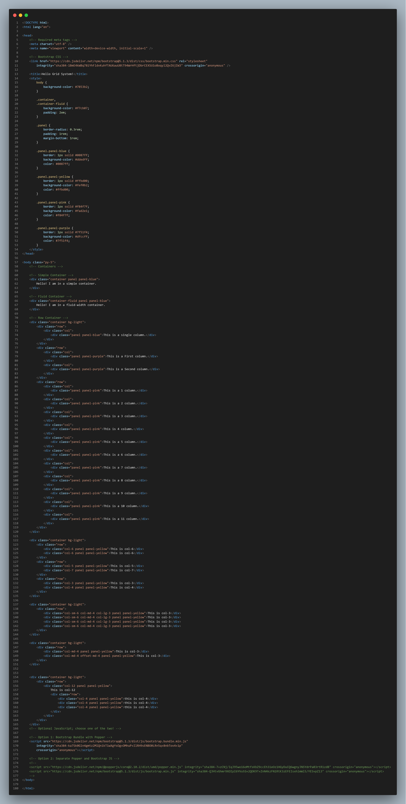

# BootStrap-Understsnding-Grid-System
🚀I Learn Bootstrap Grid-System To make Code for understanding this Topics &amp; Bootstrap 👌

   

  <h3>This is a screenshot of my code for understanding this ( Grid System)</h3>

